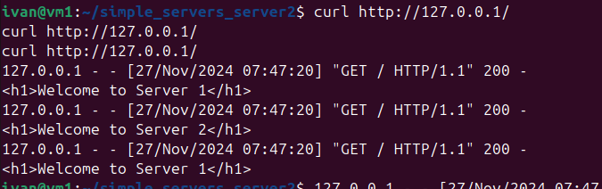
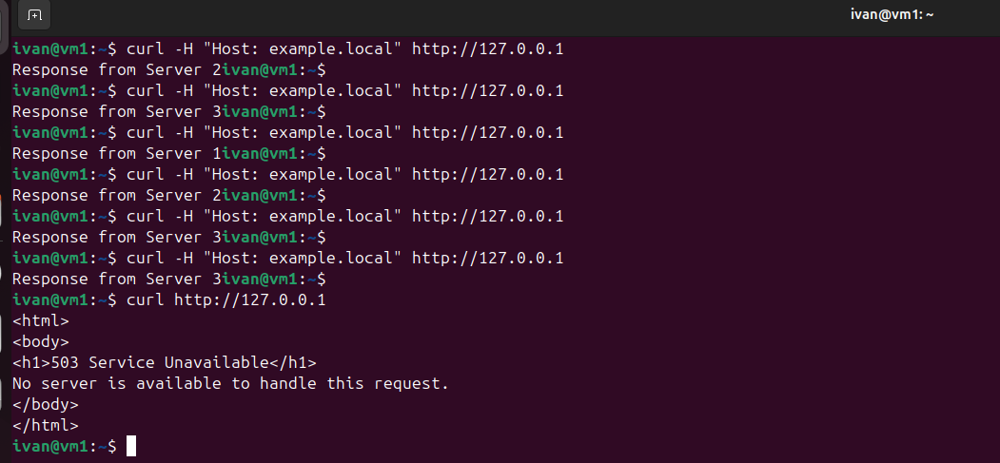

# Домашнее задание к занятию "`Clustering and Load Balancing`" - `Лесюк Иван`

---

### Задание 1

**Описание задания:**  
Запустить два simple Python-сервера на разных портах. Настроить HAProxy. Настроить балансировку Round-robin на 4 уровне.

**Выполненные шаги:**  

1. Запустил два Python-сервера:
   - Сервер 1: Порт `8081`, возвращает `Welcome to Server 1`.
   - Сервер 2: Порт `8082`, возвращает `Welcome to Server 2`.

2. Настроил HAProxy с алгоритмом Round-robin для балансировки запросов между двумя серверами.

3. Проверил работу HAProxy с помощью `curl` и браузера.

---

### Скриншоты

1. **Чередование запросов через HAProxy (curl):**
   

2. **Ответ сервера 1 через браузер:**
   

3. **Ответ сервера 2 через браузер:**
   

---

### Прикрепленные файлы

1. [Конфигурационный файл HAProxy](./haproxy.cfg)  

---

### Задание 2

**Описание задания:**  
Запустить три Python-сервера на разных портах. Настроить балансировку Weighted Round Robin с весами 2, 3 и 4 для серверов, и настроить HAProxy на балансировку трафика только для домена `example.local`.

**Выполненные шаги:**  
1. Запустил три Python-сервера на портах `8081`, `8082` и `8083`.
2. Настроил балансировку Weighted Round Robin в HAProxy с весами:
   - Сервер 1: Порт `8081`, вес 2.
   - Сервер 2: Порт `8082`, вес 3.
   - Сервер 3: Порт `8083`, вес 4.
3. Настроил HAProxy для обработки только запросов с доменом `example.local`.

**Результат:**  
Запросы с заголовком `Host: example.local` чередуют ответы от серверов в соответствии с их весами.

---

### Скриншоты

1. **Чередование ответов серверов:**  
   

---

### Прикрепленные файлы

1. [Конфигурационный файл HAProxy](./haproxy_task2.cfg)

